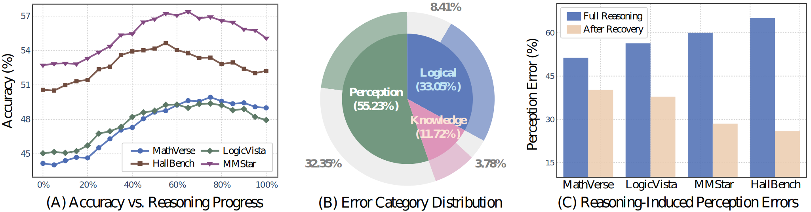
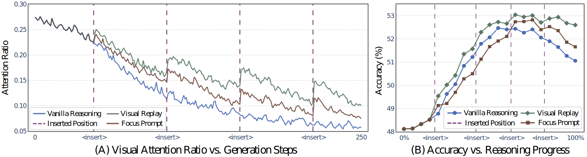
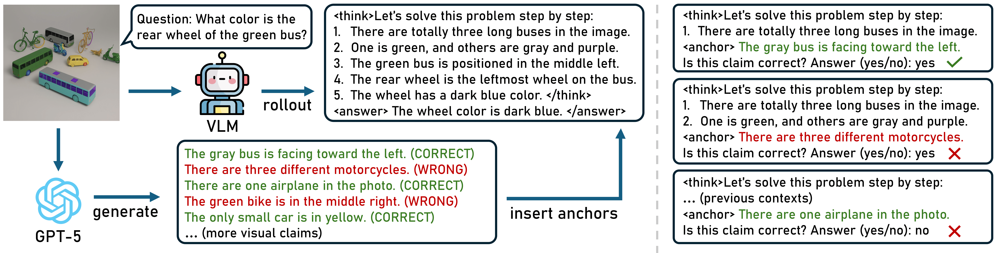
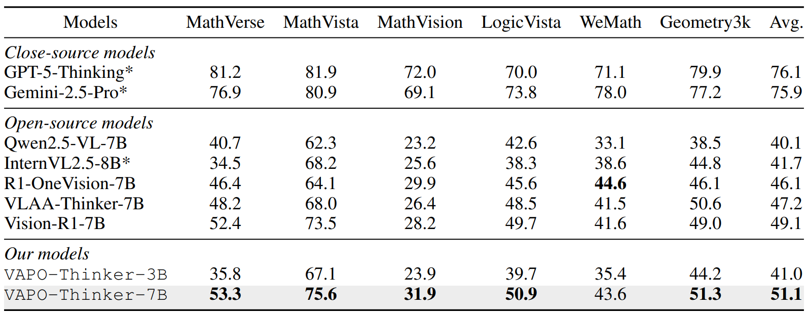
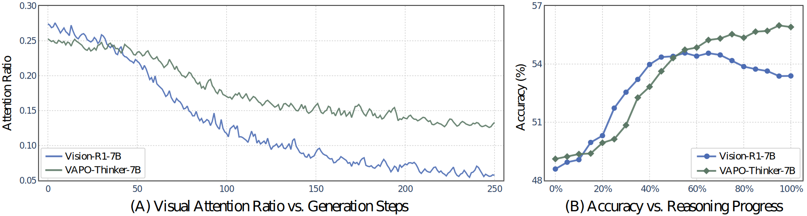

<div align="center">

# **More Thought, Less Accuracy? On the Dual Nature of Reasoning in Vision-Language Models (ICLR 2026)**

</div>

<p align="center"><i>A sober look at the pros and cons of multimodal reasoning with comprehensive findings, and a new RL method as a multimodal replacement of GRPO, achieving new state-of-the-art results.</i></p>

<div align="center">

[](https://xytian1008.github.io/VAPO/)
[](https://arxiv.org/abs/2509.25848)
[](https://github.com/xytian1008/VAPO)
</div>

This is the official implementation of the paper 'More Thought, Less Accuracy? On the Dual Nature of Reasoning in Vision-Language Models'.

# News📰

* **`[2026/03/29]`:** 🔥 **We have released our training datasets.**
* **`[2026/03/20]`:** 🔥 **We have released our code and models.**
* **`[2026/01/25]`:** 🎉 **Our paper has been accepted to ICLR 2026!**
* **`[2025/10/01]`:** 🔥 **We have released our paper [[Arxiv](https://arxiv.org/abs/2509.25848)].**

# Key Findings🔍



🌟 **Longer reasoning does not guarantee better performance**: By breaking down the reasoning chains, we observe that the early stages of reasoning significantly enhance model accuracy. However, as reasoning continues, this performance gain gradually saturates and may even begin to reverse in later stages.

🌟 **The harder the model thinks, the worse the model sees**: Our error analysis reveals that prolonged reasoning is accompanied by an increase in perception errors, where the model incorrectly recognize or interpret visual details. This degradation in perceptual accuracy is a key factor underlying the negative effect of reasoning.

🌟 **The harms of reasoning are most evident in vision-heavy tasks**: In contrast to tasks with simple visual structures such as math, the adverse impact of reasoning on perception becomes more pronounced in vision-intensive problems involving high-resolution real-world images or perceptually elusive content.



🌟 **Encouraging models to look more often boosts reasoning**: We find that the drawbacks brought by reasoning stem from visual forgetting, where extended textual output leads the model to increasingly disregard visual cues. Encouraging models to attend to visual input effectively raises the upperbound of reasoning performance.

# Methodology📖



We propose **Vision-Anchored Policy Optimization (VAPO)**, a simple yet effective policy gradient algorithm as a multimodal replacement of GRPO that explicitly steers the reasoning process toward visually grounded trajectories. The key idea of VAPO is to embed a sequence of visual anchors along the reasoning path. At each anchor point, the model's perceptual capability is probed by evaluating its responses to a set of primitive visual claims. Beyond standard outcome-based rewards such as accuracy and format, we introduce perception reward, which quantifies the model's overall perceptual grounding during reasoning by aggregating scores across all anchor points.

# Main Results🗒️



✅ **VAPO consistently improves accuracy across diverse benchmarks**: Our model outperforms recent reasoning models of the same scale on mathematical problems, achieving an average improvement of 2% (49.1% → 51.1%). The advantage is more pronounced on general-purpose tasks, where our method surpasses previous best results by 3.2% (59.9% → 63.1%), thereby establishing a new state of the art.



✅ **VAPO fully releases the potentials of reasoning**: Compared with the baseline, our model demonstrates a more gentle decline in visual attention ratio, indicating that VAPO effectively strengthens the contribution of visual cues to reasoning process. The benefit brought by this is directly reflected in accuracy, where in contrast to the baseline which exhibits a sharp performance decline, our method achieves steadily increasing accuracy.

# Getting Started🚀

## Installation

**Requirements:** Python ≥ 3.9, CUDA-compatible GPUs, `torch`, `vllm >= 0.8.0`, `transformers >= 4.51.0`.

```bash
git clone https://github.com/xyu-tian/VAPO.git
cd VAPO
pip install -e .
```

## Dataset

We release the VAPO training data on Hugging Face. The dataset is curated from [ViRL39K](https://huggingface.co/datasets/TIGER-Lab/ViRL39K) and contains generated visual anchors for probing the perception capability, which are inserted into the reasoning process during training.

| Split | HuggingFace Hub | Size |
|-------|----------------|------|
| Train | [🤗 xytian1008/VAPO-Thinker-train36k](https://huggingface.co/datasets/xytian1008/VAPO-Thinker-train36k) | ~36k |
| Val   | [🤗 xytian1008/VAPO-Thinker-val1k](https://huggingface.co/datasets/xytian1008/VAPO-Thinker-val1k)       | ~1k  |

## Pretrained Models

We release VAPO-Thinker checkpoints on Hugging Face:

| Model | Base | HuggingFace Hub |
|-------|------|----------------|
| VAPO-Thinker-7B | Qwen2.5-VL-7B-Instruct | [🤗 xytian1008/VAPO-Thinker-7B](https://huggingface.co/xytian1008/VAPO-Thinker-7B) |
| VAPO-Thinker-3B | Qwen2.5-VL-3B-Instruct | [🤗 xytian1008/VAPO-Thinker-3B](https://huggingface.co/xytian1008/VAPO-Thinker-3B) |

---

## Training

### Quick Start

The fastest way to reproduce the paper's 7B result is to run the provided training script directly. It assumes 8× A100-80G GPUs on a single node.

```bash
bash examples/qwen2_5_vl_7b_train36k_vapo.sh
```

For the 3B model on 2 GPUs:

```bash
bash examples/qwen2_5_vl_3b_virl36k_vapo.sh
```

---

## Inference

VAPO-Thinker models are standard Qwen2.5-VL checkpoints and can be run with any Qwen2.5-VL-compatible inference stack.

### Using Transformers

```python
from transformers import Qwen2_5_VLForConditionalGeneration, AutoProcessor
from qwen_vl_utils import process_vision_info

model = Qwen2_5_VLForConditionalGeneration.from_pretrained(
    "xytian1008/VAPO-Thinker-7B",   # or a local checkpoint path
    torch_dtype="auto",
    device_map="auto",
)
processor = AutoProcessor.from_pretrained("xytian1008/VAPO-Thinker-7B")

messages = [
    {
        "role": "user",
        "content": [
            {"type": "image", "image": "path/to/image.jpg"},
            {"type": "text", "text": "Your question here.\n\nYou first think through the reasoning process as an internal monologue, enclosed within <think> </think> tags. Then, provide your final answer enclosed within \\boxed{}."},
        ],
    }
]

text = processor.apply_chat_template(messages, tokenize=False, add_generation_prompt=True)
image_inputs, video_inputs = process_vision_info(messages)
inputs = processor(text=[text], images=image_inputs, return_tensors="pt").to(model.device)

output_ids = model.generate(**inputs, max_new_tokens=2048)
trimmed = output_ids[:, inputs["input_ids"].shape[1]:]
response = processor.batch_decode(trimmed, skip_special_tokens=True)[0]
print(response)
```

### Using vLLM

```python
from vllm import LLM, SamplingParams

llm = LLM(
    model="xytian1008/VAPO-Thinker-7B",
    dtype="bfloat16",
    max_model_len=8192,
)
sampling_params = SamplingParams(temperature=0.0, max_tokens=2048)

prompt = (
    "<|im_start|>user\n"
    "<|vision_start|><|image_pad|><|vision_end|>"
    "Your question here.\n\n"
    "You first think through the reasoning process as an internal monologue, "
    "enclosed within <think> </think> tags. Then, provide your final answer enclosed within \\boxed{}."
    "<|im_end|>\n<|im_start|>assistant\n"
)
outputs = llm.generate([{"prompt": prompt, "multi_modal_data": {"image": "path/to/image.jpg"}}], sampling_params)
print(outputs[0].outputs[0].text)
```

### Evaluation

Evaluation is handled via [VLMEvalKit](https://github.com/open-compass/VLMEvalKit), which is bundled in this repo. To run the full benchmark suite used in the paper:

```bash
python run.py \
    --model VAPO-Thinker-7B \
    --data MMStar HallusionBench MMMU MMVet MathVerse MathVista LogicVista
```

Run `python run.py --help` for the full list of supported models and datasets.

---

# Acknowledgements🥰

Our implementation is built upon several outstanding open-source frameworks, including Easy-R1 and Verl for training, and VLMEvalKit for evaluation. In addition, we leverage a wide range of publicly available datasets, benchmarks, and pretrained models. We also gratefully acknowledge Lambda GPU Cloud and Maincode for providing computational resources.

# Citation🎓

```
@article{tian2025more,
  title={More Thought, Less Accuracy? On the Dual Nature of Reasoning in Vision-Language Models},
  author={Tian, Xinyu and Zou, Shu and Yang, Zhaoyuan and He, Mengqi and Waschkowski, Fabian and Wesemann, Lukas and Tu, Peter and Zhang, Jing},
  journal={arXiv preprint arXiv:2509.25848},
  year={2025}
}
```
# License📄

This project is licensed under the MIT License - see the [LICENSE](LICENSE) file for details.